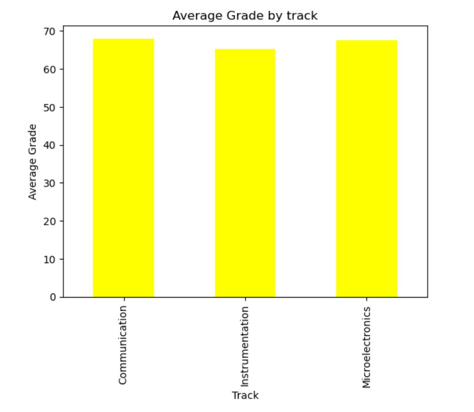
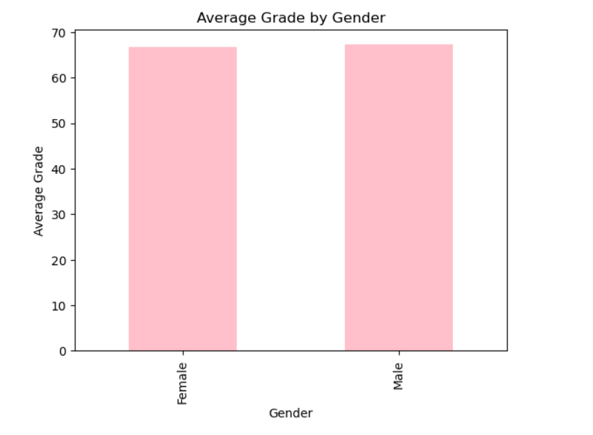
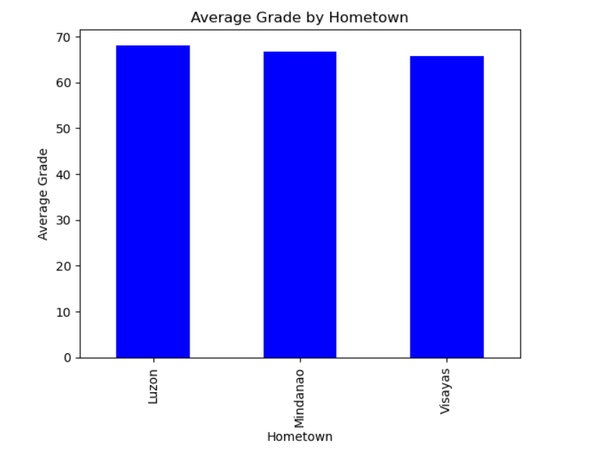

# PROGRAMMING-ASSIGNMENT-4---DATA-WRANGLING-AND-DATA-VISUALIZATION
deadline: September 25, 2025

<br>

## Table of Contents
1. Objectives
2. Programming Assignment 4.1
3. Programming Assignment 4.2
4. Author

<br>

## I. Objectives
1. To identify the codes and functions needed in cleaning and visualizing data 
2. To be able to apply and use the different codes and functions in creating a Python program that will be used in data wrangling and data visualization

<br>

## II. Programming Assignment 4.1
``Instruction ``
Create the following data frames based on the format provided: 

#### (a) Filename: Instru = [“Name”, “GEAS”, “Electronics >70”]; where track is constant as Instrumentation and hometown Luzon

##### Entire Code:
```python
import pandas as pd 

raw_a = pd.read_excel("board2.xlsx") 
Instru = raw_a.loc [(raw_a["Track"]=='Instrumentation') 
                 & (raw_a["Hometown"]=='Luzon') 
                 & (raw_a["Electronics"]>70), 
                 ['Name', 'GEAS', 'Electronics']].reset_index(drop = True)
Instru
```
##### Step-by-step Thought Process.
1. First, I have imported the pandas library as pd as it is used throughout the code.
```python
import pandas as pd 
```
2. Next, I loaded and read the Excel file named "board2.xlsx" and stored it in raw_a as a dataframe. 
```python
raw_a = pd.read_excel("board2.xlsx") 
```
3. Then, I used a .loc to locate the necessary values needed. Inside .loc I have included three conditions: 1st is that in the "Track" column, the row containing "Instrumentation" is to be located, 2nd is that the "Hometown" column, the row containing "Luzon" is to be located, and lastly, the in the Electronics Column, the row containing a value greater than 70 is to be selected. With those conditions, I have also included the columns "Name", "GEAS", and "Electronics" in the dataframe. All these are stored in "Instru" and their index value got reset.
```python
Instru = raw_a.loc [(raw_a["Track"]=='Instrumentation') 
                 & (raw_a["Hometown"]=='Luzon') 
                 & (raw_a["Electronics"]>70), 
                 ['Name', 'GEAS', 'Electronics']].reset_index(drop = True) 
```
4. Lastly, I printed "Instru" to check the dataframe.
```python
Instru
```

<br>

#### (b) Filename: Mindy = [ “Name”, “Track”, “Electronics”, “Average >=55”]; where hometown is constant as Mindanao and gender Female 

##### Entire Code:
```python
import pandas as pd 

raw_b = pd.read_excel("board2.xlsx") 
raw_b['Average'] = raw_b[['Math','Electronics','GEAS','Communication']].mean(axis=1) 

mindy = raw_b.loc[(raw_b["Hometown"]=='Mindanao') 
                & (raw_b["Gender"]=='Female') 
                & (raw_b["Average"]>=55), 
                ['Name','Track', 'Electronics','Average']].reset_index(drop = True)
mindy
```

##### Step-by-step Thought Process.
1. First, I have imported the pandas library as pd as it is used throughout the code.
```python
import pandas as pd 
```
2. Next, I loaded and read the Excel file named "board2.xlsx" and stored it in raw_b as a dataframe. 
```python
raw_b = pd.read_excel("board2.xlsx") 
```
3. Then, I added a column to the dataframe named raw_b with a column name of "Average"; inside this column is the average of the four subjects by getting the mean row-wise in the column per students. 
```python
raw_b['Average'] = raw_b[['Math','Electronics','GEAS','Communication']].mean(axis=1) 
```
4. Then, I used .loc function, inside this is three conditions. Namely, the following,
Condition 1: Select only the rows containing "Mindanao" in the "Hometown" Column.
Condition 2: Select only the rows containing "Female" in the "Gender" Column.
Condition 3: Select only the rows containing a value greater than or equal to 55 in the "Average" Column.
With all these conditions, I have included in the data frama the columns: "Name", "Track", "Electronics" and "Average". All these are stored in "mindy" and their index got reset.
```python
mindy = raw_b.loc[(raw_b["Hometown"]=='Mindanao') 
                & (raw_b["Gender"]=='Female') 
                & (raw_b["Average"]>=55), 
                ['Name','Track', 'Electronics','Average']].reset_index(drop = True)
```
5. Lastly, I printed "mindy" to check the dataframe.
```python
mindy
```
<br>

## II. Programming Assignment 4.2
``Instruction``
Create a visualization that shows how the different features contributes to average grade. Does chosen track in college, gender, or hometown contributes to a higher average score? 

##### Entire Code for calculations:
```python
import pandas as pd 

raw2 = pd.read_excel("board2.xlsx") 
raw2['Average'] = raw2[['Math','Electronics','GEAS','Communication']].mean(axis=1) 


Avg_Track = raw2.groupby("Track")["Average"].mean() 
Avg_Gender = raw2.groupby("Gender")["Average"].mean() 
Avg_Hometown = raw2.groupby("Hometown")["Average"].mean() 

Avg_Track_df = raw2.groupby("Track")["Average"].mean().reset_index() 
Avg_Gender_df = raw2.groupby("Gender")["Average"].mean().reset_index() 
Avg_Hometown_df = raw2.groupby("Hometown")["Average"].mean().reset_index() 
```

##### Entire Code for data visualization graph 1:
Graph 1: Average Grades by Track
```python
import matplotlib.pyplot as plt

Avg_Track.plot(kind="bar", color="Yellow", title="Average Grade by track", ylabel="Average Grade", xlabel="Track")
plt.show()
```

##### Entire Code for data visualization graph 2:
Graph 2: Average Grades by Gender
```python
import matplotlib.pyplot as ply

Avg_Gender.plot(kind="bar", color="pink", title = "Average Grade by Gender", ylabel="Average Grade", xlabel="Gender")
plt.show()
```


##### Entire Code for data visualization graph 3:
Graph 3: Average Grades by Hometown
```python
import matplotlib.pyplot as ply

Avg_Hometown.plot(kind="bar", color="blue", title="Average Grade by Hometown", ylabel="Average Grade", xlabel="Hometown")
plt.show()
```

<br>

##### Step-by-step Thought Process.
1. First, I have imported the pandas library as pd as it is used throughout the code.
```python
import pandas as pd 
```
2. I then loaded and read the Excel file named "board2.xlsx" and stored it in raw2 as a dataframe. I also added a column named "Average" in the dataframe raw2. Inside this column contains the average of the 4 subjects per student by getting the mean of the students' values in the four subjects row-wise.
```python
raw2 = pd.read_excel("board2.xlsx") 
raw2['Average'] = raw2[['Math','Electronics','GEAS','Communication']].mean(axis=1) 
```
3. Then, I grouped the dataframe "raw2" by "Track", "Gender", and "Hometown" separately. After grouping them, I calculated the mean of the Average column for each group. 
```python
Avg_Track = raw2.groupby("Track")["Average"].mean() 
Avg_Gender = raw2.groupby("Gender")["Average"].mean() 
Avg_Hometown = raw2.groupby("Hometown")["Average"].mean() 
```
4. I also made a dataframe containing the same key and values as above by using .reset_index().
```python
Avg_Track_df = raw2.groupby("Track")["Average"].mean().reset_index() 
Avg_Gender_df = raw2.groupby("Gender")["Average"].mean().reset_index() 
Avg_Hometown_df = raw2.groupby("Hometown")["Average"].mean().reset_index() 
```
5. I first imported matplotlib.pyplot as plt for me to use the graphs and plots. Then I visualized the average grade per Track using a bar chart through Avg_Track that was made earlier. I plotted Avg_Track values with the following arrangement:
kind: bar
color: yellow
title: "Average Grade by Track"
ylabel: "Average Grade"
xlabel: "Track"
```python
import matplotlib.pyplot as plt

Avg_Track.plot(kind="bar", color="Yellow", title="Average Grade by track", ylabel="Average Grade", xlabel="Track")
plt.show()
```
6. I imported matplotlib.pyploy as ply so I could create graph. Then I visuaized the average grade per Gender using a bar chart through Avg_Gender that was made earlier. I plotted the Avg_Gender with the following arrangement:
kind: bar
color: pink
title: "Average Grade by Gender"
ylabel: "Average Grade"
xlabel: "Gender"
```python
import matplotlib.pyplot as ply

Avg_Gender.plot(kind="bar", color="pink", title = "Average Grade by Gender", ylabel="Average Grade", xlabel="Gender")
plt.show()
```
7. I imported matplotlib.pyplot as ply again so I could create the graph. Then I visualized the average grade per Hometown using a bar chart through Avg_Hometown that was made earlier. I plotted the Avg_Hometown values with the following arrangement:
kind: bar
color: blue
title: "Average Grade by Hometown"
ylabel: "Average Grade"
xlabel: "Hometown"
```python
import matplotlib.pyplot as ply

Avg_Hometown.plot(kind="bar", color="blue", title="Average Grade by Hometown", ylabel="Average Grade", xlabel="Hometown")
plt.show()
```

###### Results of the graphs


``This tells us the students in the Communication Track have the highest average grade, which is slightly higher than Microelectronics, while the Instrumentation track has the lowest average grade. This suggests that some chosen tracks have some influences but not very large.``

<br>



``Males score higher average compared to females by 1. This suggests that gender does not significantly affect the overall passing rate.``

<br>



``Students from Luzon have the highest average grades, followed by students from Mindanao and Visayas. Their difference is about 2-3 points, which suggests that hometown might have only a  slight influence on the passing rate``

<br>

## III. Author 
Name: Cagurangan, Jos Kendrick L.
Section: 2ECE - B


